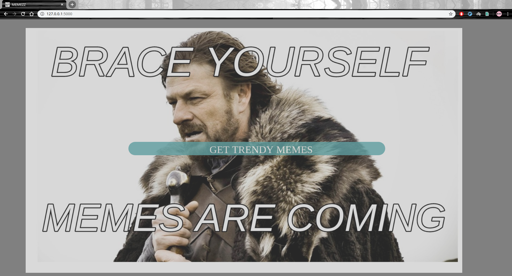
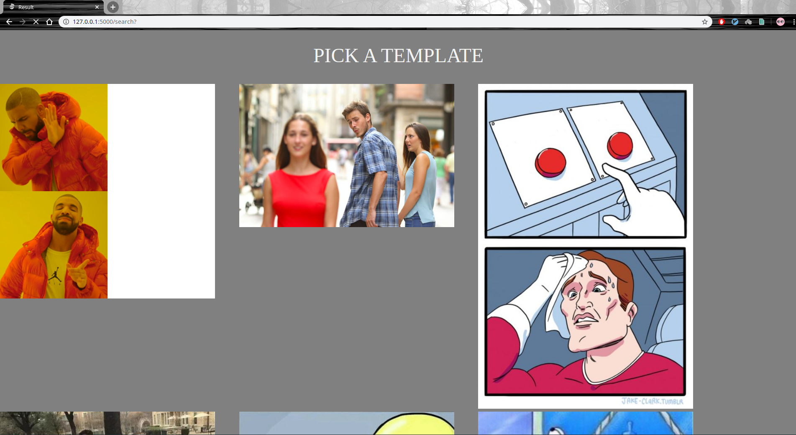
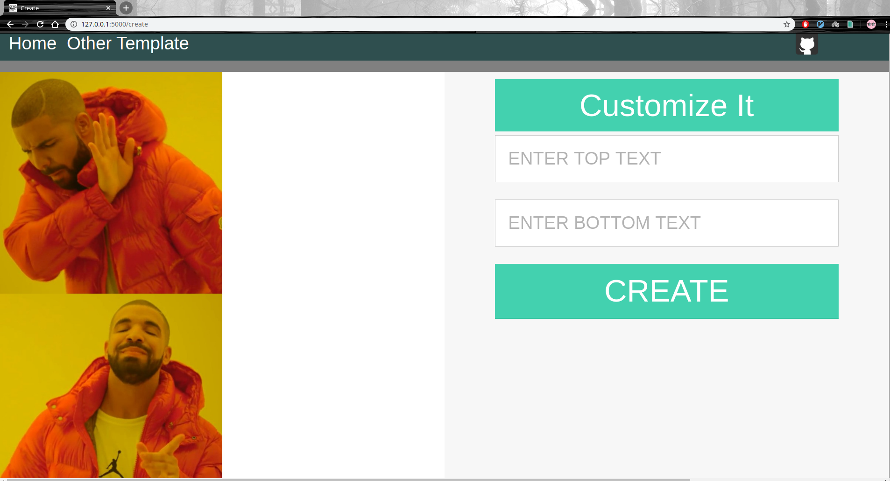
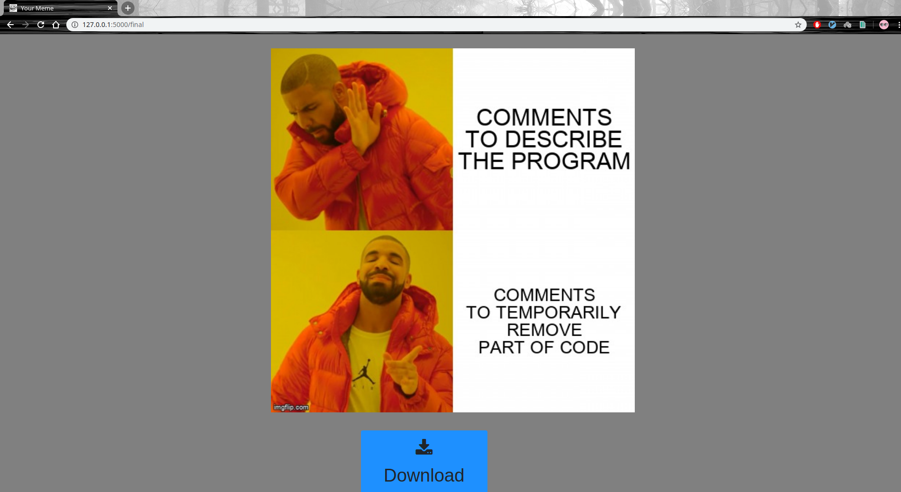

# creatememes
It is a flask web-app using which one can create memes.   .  
You can select from variety of templates and eneter your own texts to be used in them.  
It is deployed on Heroku .    

  

Link : https://creatememes.herokuapp.com/
  

  
  

  
  

  
  

